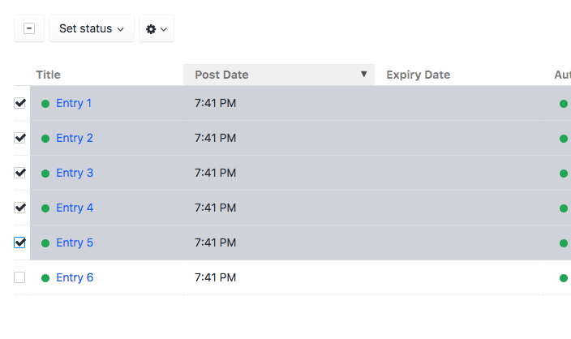
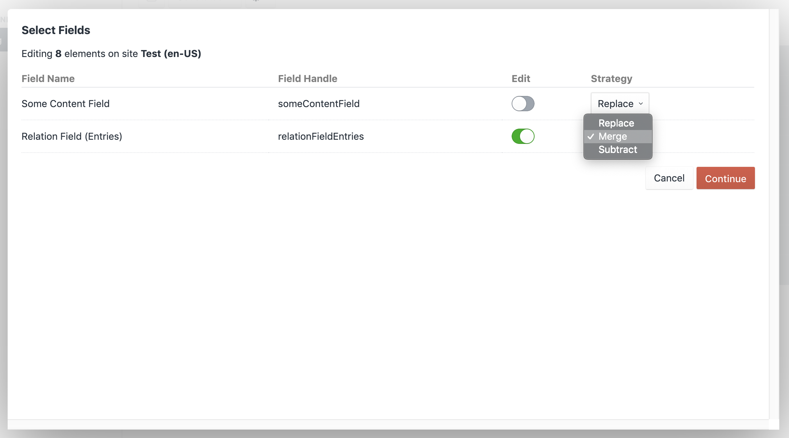
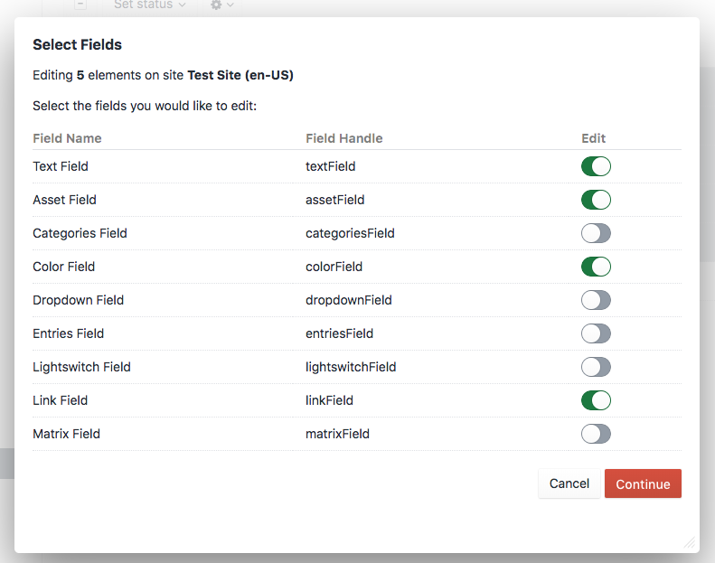

# Bulk Edit plugin for Craft CMS 3.2+

## Overview
The Bulk Edit plugin adds an action to supported element index pages that allows you to edit fields on a large number of
elements at once. Currently, the following element types are supported:
- Entries
- Categories
- Assets
- Users
- Craft Commerce Products

Additionally, some fields support different strategies for the edit process. At the moment, any field that works with
 "relations" (such as Entries, Categories, Assets, etc) supports the following strategies:
 - Replace: Replaces all content in the field
 - Merge: Merges the selected elements into the relation field
 - Subtract: Removes the selected elements from the relation field

## Instructions
1. Navigate to a supported element index page and select any number of elements
2. Click the gear at the top of the page and select "Bulk Edit"
3. Enable the light-switches next to the fields you're interested in editing and select a strategy
4. Click next and enter the content for the fields
5. Once you click Save, a task will be dispatched to the queue, at which point you will need to refresh the page for 
Craft to pick it up. After the queue has finished, you may reload the page and see your changes.

## Limitation & Issues
* Validation is not enforced when you're editing these fields, this means you can end up with elements with fields in 
potentially erroneous states (for example, removing all content on a required field)
* After the queue finishes running, make sure you refresh the page to see the updates in the element index

## Steps to use:

## Requirements

This plugin requires Craft CMS 3.2.0 or later.

## Installation

To install the plugin, follow these instructions.

1. Open your terminal and go to your Craft project:

        cd /path/to/project

2. Then tell Composer to load the plugin:

        composer require venveo/craft-bulkedit

3. In the Control Panel, go to Settings → Plugins and click the “Install” button for Bulk Edit.

Brought to you by [Venveo](https://venveo.com)
